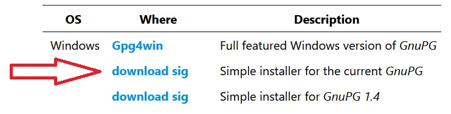

## Установка GPG и работа с ключами

- [Установка в Windows](#Установка-в-Windows)
- [Установка в Linux](#Установка-в-Linux)
- [Информация о формате ключей](#Информация-о-формате-ключей)
- [Создание ключей](#Создание-ключей)
- [Экспорт ключей](#Экспорт-ключей)
- [Передача ключей между устройствами](#Передача-ключей-между-устройствами)
- [Импорт ключей на компьютере](#Импорт-ключей-на-компьютере)
- [Краткий перечень инструкций для работы с GPG](#Краткий-перечень-инструкций-для-работы-с-GPG)
- [О безопасности](#О-безопасности)


### Установка в Windows

Скачать установщик с [официального сайта](https://gnupg.org/download/). Нам достаточно упрощенного установщика текущей версии:


Установить GPG. Никакие параметры во время установки менять не нужно.

Работать с программой можно через консоль (cmd или powershell).


### Установка в Linux

Команды для установки будут отличаться в зависимости от пакетного менеджера, используемого в системе. Приведу несколько примеров.

Pacman:
```
sudo pacman -Syy
sudo pacman -S pass
```

Apt:
```
sudo apt update
sudo apt install pass
```


### Информация о формате ключей

Для манипуляций с GPG ключами используется их имя.
Для вывода списка ключей введите команду `gpg --list-keys`.
Команда отобразит список ключей в следующем формате (если вы только что установили GPG и еще не выполняли команды для генерации или импорта ключей, список будет пустым):

```
pub   rsa3072 2022-03-21 [SC] [expires: 2024-03-20]
      6D9606957342E63C507D6D181741CBFA7994142B
uid           [TRUST_LEVEL] NAME <EMAIL>
sub   rsa3072 2022-03-21 [E] [expires: 2024-03-20]
```

> Информация о вашем ключе будет отличаться от приведенной здесь.
Образец вывода показан для объяснения нужных в дальнейшей работе полей

На месте полей `NAME` и `EMAIL` выводятся имя и почта пользователя, которые были указаны при создании ключа.
В командах, которые описаны ниже, вместо текста `<uid>` нужно вставлять `NAME` ключа.

На месте `TRUST_LEVEL` указан уровень доверия ключу. О доверии к ключам подробнее сказано в разделе [импорт ключей](#Импорт-ключей-на-компьютере).


### Создание ключей

Для создания новой пары ключей введите команду `gpg --gen-key`

Программа запросит некоторые данные о пользователе: имя, адрес электронной почты, и попросит подтвердить изменения.
Поля можно заполнять произвольно.
После подтверждения будет предложено ввести парольную фразу.
Эту фразу в дальнейшем нужно будет использовать при выводе списка паролей.
Поле можно оставить пустым, тогда вводить парольную фразу не придется, но рекомендуется использовать надежный пароль.


### Экспорт ключей

Для обеспечения работы pass на нескольких устройствах на них нужно использовать одинаковые ключи GPG.
Для этого нужно уметь экспортировать их с устройства, на котором они были созданы.

Для экспорта ключей введите команды (на месте `<public_key_file>` и `<private_key_file>` укажите желаемые пути до файлов):
```
gpg --armor --export --output <public_key_file> <uid> для экспорта публичного ключа
gpg --armor --export-secret-key --output <private_key_file> <uid> для экспорта приватного ключа
```

Если при создании ключей была указана парольная фраза, при экспорте приватного ключа ее понадобится ввести.

:exclamation: Не передавайте приватный ключ людям, которым не доверяете.


### Передача ключей между устройствами

При передаче ключей между устройствами не следует размещать ключи в открытом виде на публичных файлообменниках, в мессенджерах, соцсетях и тд.

Для защиты ключей на время передачи можно использовать архиваторы с поддержкой функции шифрования.
Это не лучшее решение, но оно достаточно безопасно, и программы с необходимым функционалом есть на любой платформе.

После создания зашифрованного архива с ключами можно воспользоваться удобным способом для передачи ключей на другое устройство.
После получения архива на устройстве нужно достать из него ключи, введя пароль повторно.

> Если для передачи ключей вы использовали сторонние ресурсы, после их получения на устройстве удалите файлы из публичного доступа.


### Импорт ключей на компьютере

Введите команды (замените `<public_key_file>` и `<private_key_file>` на актуальное расположение файлов):
```
gpg --import <public_key_file> для импорта публичного ключа
gpg --import <private_key_file> для импорта приватного ключа.
```

Если при создании ключей была указана парольная фраза, при импорте приватного ключа ее понадобится ввести.

По умолчанию GPG не доверяет импортированным ключам. Чтобы иметь возможность с ними работать, нужно пометить их как доверенные.
  
:exclamation: Не выполняйте следующие команды для ключей, которые вы получили от людей, которым вы не доверяете.

- Откройте меню GPG для управления ключом: `gpg --edit-key <uid>`
- Вводим `trust`
- Вводим `5`
- Для выхода из меню GPG вводим `quit`

После этого в списке ключей на месте TRUST_LEVEL будет указано "ultimate".
  


### Краткий перечень инструкций для работы с GPG

`gpg --gen-key` — сгенерировать новую пару из публичного и приватного ключей

`gpg --list-keys` — вывести список публичных ключей

`gpg --export <uid> --armor --output <public_key_file>` — экспортировать публичный ключ

`gpg --export-secret-key <uid> --armor --output <private_key_file>` — экспортировать приватный ключ

`gpg --import <key_file>` — импортировать ключ.
Обратите внимание, что в рамках настройки pass вам скорее всего понадобится импортировать пару из публичного и приватного ключей.
Поэтому команду нужно выполнить дважды, для соответствующих файлов.

`gpg --edit-key <uid>` — открыть меню для управления настройками ключа


### О безопасности

В инструкциях выше упоминается пара ключей — публичный и приватный.
А так же несколько раз делается предупреждение не взаимодействовать с ключами из недоверенных источников и беречь свои ключи.
В этом разделе — краткое объяснение, зачем нужны эти ключи и почему их компроментация грозит вам потерей всех паролей.

Когда вы создаете новый пароль, утилита pass и ее клиенты на различных устройствах шифруют его при помощи публичного ключа GPG.
Благодаря этому, даже если файл с паролем попадет к злоумышленикам, они не смогут узнать его содержимое.
Единственный способ расшифровать файл и получить доступ к исходной информации — это воспользоваться парным приватным ключом.

Поэтому очень важно, во-первых, хранить свой приватный ключ в безопасности и не предъявлять его сторонним лицам.
Ведь с ним можно узнать все сохраненные вами пароли.
Во-вторых, не использовать ключи, которые пришли к вам от непроверенных лиц.
Потому что если вы зашифруете пароль чужим публичным ключом, его можно будет расшифровать парным приватным — а вы не знаете, кто им владеет.
И в третьих, удалять копии файлов с ключами, как только они становятся не нужны.
